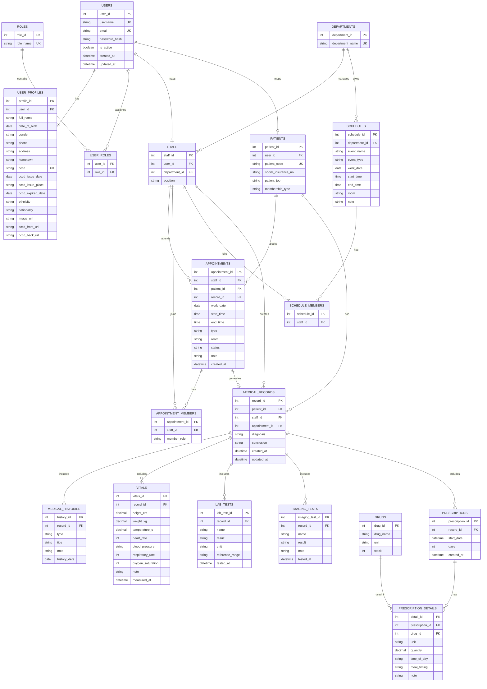

# Telemedicine DB ERD (MVP)

## Notes
- `status` in `APPOINTMENTS`: `pending | confirmed | canceled`.
- Add unique indexes for `username`, `email`, `cccd`, and `patient_code`.
- `MEDICAL_RECORDS` is root clinical entity; all clinical details hang off `record_id`.
